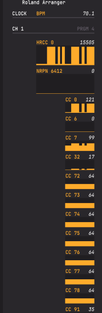
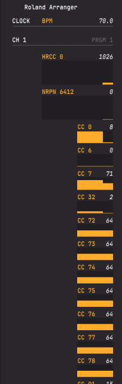
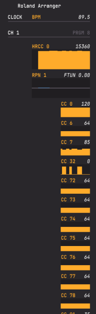
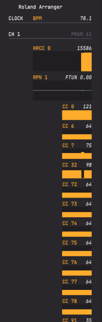

+++
title = "Setting up MIDI mappings in Arturia softwares without a MIDI controller"
date = 2024-08-07T20:34:08-03:00
+++

If you don't have a MIDI controller, you might wonder how you can make use of the MIDI mappings on Arturia's various emulators
and Analog Lab V (which usually are controlled by knobs and faders). In this post, I'll demonstrate how to use [ShowMIDI](https://github.com/gbevin/ShowMIDI)
to view which buttons on your keyboard can be used as substitutes for the controls of a MIDI controller.

## Installing ShowMIDI

Head over to [the releases page](https://github.com/gbevin/ShowMIDI/releases), download the installer for your platform
and run it. Alternatively, download it through a package manager.

## Identifying usable controls

Let's start by identifying what controls on your keyboard trigger MIDI signals. I will be using a Roland E-X20A arranger
keyboard.

*(this is a screenshot of an E-X20, but the only difference between them is that the A variant has some extra ethnic instrument
voices and styles)*

Open ShowMIDI and select your keyboard once it's plugged in. If you have any software open that's using it, close it or
unselect it in the Audio MIDI Settings menu, otherwise the inputs will be sent to the emulator instead of ShowMIDI.

Start twisting any knobs and pressing buttons, and note every control that ShowMIDI indicates as having sent a message.

In my keyboard, the only controls that send messages control the currently selected voice (M1, M2, M3, M4, O.T.S., PIANO,
current selection down and up, and any valid voice selected via the numpad). Unfortunately, the volume knob, which is the
only control I could use for finer control over a fader, doesn't send anything, but it can be replaced by buttons that
send specific values (so for example, you could program the vibrato speed of a Rhodes to be set specifically to 20% or 80%).
However, this means I can select certain voices as to produce the values I want.

## Example: setting fast/slow Leslie speed for the B-3

In this [old Analog Lab 2 manual](https://downloads.arturia.com/products/analoglab/manual/Analog_Lab_Manual_2_0_0_EN.pdf),
under the section 3.2.11.1 "How MIDI assignment works", it is stated that two-way switches update their state relative
to the value `0.5`. This means any value `>= 50` will turn the switch on, and any value `< 50` will turn it off. Let's find
a button on ShowMIDI that satisfies these conditions: 

With the voice 47 selected, pressing the PIANO button will make `CC 0` oscillate between the values 0 and 121. Let's assign
it to the rotary speaker slow/fast option.

Now, once I press the PIANO button, it should toggle between the slow/fast speeds of the B-3 Leslie speaker cabinet
emulator.



## Example: setting two buttons

For this example, let's try to make a configuration to play "Everybody Wants to Rule the World". We'll need a button to
turn off the synth in the synth + EP preset once the singing starts, and a button to switch between the synth + EP and SARRAR
presets.

This one is a bit trickier on my keyboard, because I'll have to find a set of voices which won't trigger both options at
the same time.

Saving the voices 660 and 662 as M3 and M4 allow me cycle through the presets through `CC 6`, while not interfering with
`CC 0` from the PIANO button.



## Conclusion

That's it! Hope I helped. If you have any questions open an [issue](https://github.com/zmadie/blog/issues) in the GitHub
repository hosting this blog.
